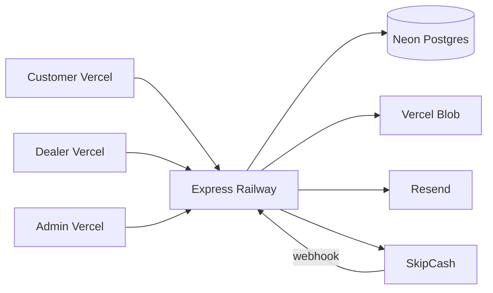

# CarFlow Production Readiness

**Status: NOT launch-ready. The launch checklist is written, not passed.**

Read this before anything else in the file:

- **CI has never been green.** Two gates in `test.yml` could not pass as written: the
  secret scan matched secret *identifiers* (`process.env.RESEND_API_KEY`) so it always
  failed, and the e2e job installed only chromium while `playwright.config.ts` defined a
  WebKit `mobile` project. Both are fixed as of today; **neither has yet been observed
  green on a real run.**
- **No release tag has ever existed.** `git tag -l` is empty.
- **`deploy.yml` has therefore never run.** It triggers on `v*` tags and
  `workflow_dispatch` only.
- **The live deployment was pushed manually from a laptop**, via
  `scripts/deploy-production-railway.ps1` / the Railway CLI — bypassing tests, the
  migration job, the smoke test and the frontend deploys.
- **Live SkipCash credentials are in the pushed history of this public repo.** They are
  burned. See `scripts/rotate-and-purge-secrets.md` — rotation has **not** been done.

Everything below describes the intended target state. Treat unticked boxes as work, not
as formality.

---

## Production stack

| Component | Service | Notes |
|-----------|---------|-------|
| Database | **Neon** Postgres | `DATABASE_URL` connection string |
| API | **Railway** (supported production target) | Long-lived Node (`node dist/index.js`); in-process scheduler + Sentry; Dockerfile deploy from monorepo root |
| Frontends | **Vercel** (3 projects) | Customer, Dealer, Admin — each with `vercel.json` SPA rewrites |
| Uploads | **Vercel Blob** | Required: `UPLOAD_DRIVER=blob` + `BLOB_READ_WRITE_TOKEN` (local disk refused at boot) |
| Email | **Resend** | Password reset, booking confirmation, email verification |
| Payments | **SkipCash** | Sandbox first, then production keys |

> **API on Vercel is deprecated.** `api/index.ts` / `apps/backend/vercel.json` do not run billing jobs or Sentry. Production must use **Railway**. The serverless entry only loads when `EXTERNAL_SCHEDULER=true` and an external cron calls `POST /api/admin/jobs/run-once` — not a supported launch topology.



---

## What is production-ready

### Money integrity
- Server computes SkipCash charge from `pricePerDay × 30 × durationMonths` (client `cart.total` ignored)
- Webhook reconciles `Amount` ±0.01 before creating bookings
- Paid-but-booking-failed payments flagged `needsRefund` for admin ops
- Admin `POST /api/admin/payments/:id/refund` + Payments UI action

### Privacy / IDOR
- Dealer customer documents require rental or booking relationship
- Upload `GET /documents/file` and `DELETE /by-url` enforce ownership (admin override)

### Auth / sessions
- Refresh sessions persisted with `jti`; revoked on logout, password change, admin suspend
- `requireAuth` rejects suspended profiles mid-session
- `SameSite=Lax; Secure` cookies with `COOKIE_DOMAIN=.yourdomain.tld` (recommended: api + app subdomains on one registrable domain)
- `SameSite=None; Secure` fallback when `COOKIE_DOMAIN` is unset (cross-origin; blocked as third-party in Safari/Chrome)
- Password min 8 + letter + number; weak JWT secrets refused at production boot

### Deploy / ops
- Multi-stage Dockerfile builds shared + backend to `dist/`
- Deploy workflow gated on full test suite (`workflow_call` to `test.yml`)
- Optional Sentry via `SENTRY_DSN`; production 500 responses sanitized

### Compliance / honesty
- Real `DELETE /api/customer/account` + PrivacySection wired
- Email verification email on signup; online pay gated on `emailVerifiedAt`
- Dealer `alert()` replaced with toasts; stub settings labeled unavailable
- Admin booking delete requires confirmation

### CI (workflows exist; see the status note at the top for what has actually run)
- `.github/workflows/test.yml` — lint, typecheck, conventions, secret scan, API, E2E
- `.github/workflows/deploy.yml` — full test suite → migrate → deploy API → smoke test
  proving the **new** container is live → three Vercel frontends
- `npm audit` runs on the test workflow as a **non-blocking, production-dependencies-only**
  signal (`--omit=dev`, `continue-on-error`). It is deliberately not a deploy gate: a
  third-party advisory in a dev dependency must not stand between an incident and its
  hotfix. Read it, do not ignore it — but it will never turn the pipeline red on its own.

---

## Production environment checklist

```bash
# Database (Neon)
DATABASE_URL=postgresql://...

# JWT (rotate before launch — 32+ chars, not dev placeholders)
JWT_ACCESS_SECRET=<strong-random>
JWT_REFRESH_SECRET=<strong-random>
JWT_2FA_SECRET=<strong-random-distinct-from-above>
COOKIE_SECURE=true
COOKIE_DOMAIN=.carflow.qa

# API
PORT=8080
CORS_ORIGINS=https://customer.example.com,https://dealer.example.com,https://admin.example.com
PUBLIC_API_URL=https://api.example.com
CUSTOMER_APP_URL=https://customer.example.com
DEALER_APP_URL=https://dealer.example.com
# REQUIRED. Staff-invite and password-set emails are built from this; unset, every
# invite mails a http://localhost:5174 link that no recipient can open.
ADMIN_APP_URL=https://admin.example.com
# Browser -> Vercel rewrite -> Railway edge -> Express = 2 proxy hops. Defaults to 2 in
# production; set it explicitly if the topology changes, or rate limits key on a shared IP.
TRUST_PROXY_HOPS=2

# Content Security Policy for API responses. Default policy is "default-src 'self'",
# sent report-only until CSP_ENFORCE=true. Run report-only first, read the reports,
# then enforce.
# CONTENT_SECURITY_POLICY=default-src 'self'
CSP_ENFORCE=true

# Uploads
UPLOAD_DRIVER=blob
BLOB_READ_WRITE_TOKEN=...
# Leave BLOB_ACCESS UNSET. `BLOB_ACCESS=public` is refused at production boot: it would
# make uploaded blobs world-readable by URL, identity documents included.
# BLOB_ACCESS=

# Background jobs (Railway — in-process scheduler on long-lived Node)
ENABLE_JOBS=true
# Set EXTERNAL_SCHEDULER=true only for legacy serverless API + external cron on POST /api/admin/jobs/run-once
# EXTERNAL_SCHEDULER=true

# Email
RESEND_API_KEY=...
FROM_EMAIL=noreply@yourdomain.com

# SkipCash (sandbox → production)
SKIPCASH_MODE=production
SKIPCASH_CLIENT_ID=...
SKIPCASH_KEY_ID=...
SKIPCASH_KEY_SECRET=...
SKIPCASH_WEBHOOK_KEY=...
# Portal paths (must be reachable on PUBLIC_API_URL): /skipcash-pay/callback, /skipcash-pay/return

# Observability — REQUIRED in production. Boot refuses to start without it unless you
# opt into running blind with ALLOW_NO_ERROR_REPORTING=true.
SENTRY_DSN=https://...

# Frontends (Vercel build env, per project)
VITE_API_URL=https://api.example.com/api
VITE_USE_MOCK_API=false
```

`.env.example` is the authoritative list and carries the defaults for every optional knob
(payout batching, retention sweeps, outbox pacing, boot/shutdown timeouts). Reconcile
against it — not against this excerpt — when standing up a new environment.

**Never run `db:seed` in production.** It plants `admin@carflow.dev` / `password123`, and
that password is published in this public repo. `db:seed` and `db:push` now refuse to run
against a non-local database unless `ALLOW_DESTRUCTIVE_SEED=true`; never set that variable
on a production host. The go-live script that used to call `db:seed` against the
production Neon URL (`scripts/setup-live-api.ps1`) has been **deleted** — use
`scripts/configure-railway-production.ps1` + `scripts/deploy-production-railway.ps1`.

---

## SkipCash configuration

> **SECURITY NOTE:** earlier revisions of this file committed real SkipCash client ids,
> key ids, and webhook keys, and those revisions are **pushed to a public repository**.
> Treat every one of those values as compromised. The rotation and history-purge runbook
> is `scripts/rotate-and-purge-secrets.md` — **rotation comes first and has not been done
> yet.** Production boot refuses the two committed webhook keys
> (`COMPROMISED_SKIPCASH_VALUES` in `apps/backend/src/utils/productionGuards.ts`), which is
> a backstop, not a fix.


Create-intent sends `ReturnUrl` and `WebhookUrl` on each payment (overrides portal defaults when set). Routes are mounted at both `/skipcash-pay/*` (portal paths) and `/api/payments/skipcash/*` (legacy/tests).

| Setting | Sandbox (test) | Production (www.carflow.qa) |
|---------|----------------|----------------------------|
| `SKIPCASH_MODE` | `sandbox` | `production` |
| `SKIPCASH_CLIENT_ID` | `<sandbox client id — from SkipCash portal>` | `<production client id — from SkipCash portal>` |
| `SKIPCASH_KEY_ID` | `<sandbox key id — from SkipCash portal>` | `<production key id — from SkipCash portal>` (enabled Card Checkout) |
| `SKIPCASH_KEY_SECRET` | From portal Copy Key | From portal Copy Key — **host secrets only** |
| `SKIPCASH_WEBHOOK_KEY` | `<sandbox webhook key — from SkipCash portal>` | `<production webhook key — ROTATE: previous value was committed>` |
| Portal webhook | `http://test.carflow.4livedemo.com/skipcash-pay/callback` | `https://www.carflow.qa/skipcash-pay/callback` |
| Portal return | `http://test.carflow.4livedemo.com/skipcash-pay/return` | `https://www.carflow.qa/skipcash-pay/return` |

**Local dev:** set sandbox vars in gitignored `.env`. SkipCash cannot POST webhooks to `localhost` — use the deployed test host (`test.carflow.4livedemo.com`) or an HTTPS tunnel, and set `PUBLIC_API_URL` to that public origin.

**Production deploy (Railway):** set production `SKIPCASH_*` via Railway service variables (never in local `.env`). If the API runs on a separate host from `www.carflow.qa`, either proxy `/skipcash-pay/*` to the API or set `PUBLIC_API_URL` to the API origin that mounts these routes.

```powershell
# Example Railway service variables (paste full KEY_SECRET from portal)
railway service carflow-api
railway variable set `
  SKIPCASH_MODE=production `
  SKIPCASH_CLIENT_ID=<production client id — from SkipCash portal> `
  SKIPCASH_KEY_ID=<production key id — from SkipCash portal> `
  SKIPCASH_KEY_SECRET='...' `
  SKIPCASH_WEBHOOK_KEY=<production webhook key — ROTATE: previous value was committed> `
  PUBLIC_API_URL=https://www.carflow.qa `
  CUSTOMER_APP_URL=https://www.carflow.qa
```

---

## Staging go / no-go (run before production keys)

| Check | Pass |
|-------|------|
| Secrets rotated; no `dev-*-change-me` JWT values | ☐ |
| `COOKIE_SECURE=true` + `COOKIE_DOMAIN=.carflow.qa` (optional until custom domain); login works from customer/dealer/admin Vercel origins against Railway API | ☐ |
| `GET /health` returns `"db":"connected"`; Railway service stays online after deploy | ☐ |
| SkipCash sandbox: create-intent → webhook at `/skipcash-pay/callback` → booking → dealer approve → rental | ☐ |
| SkipCash keys **rotated in merchant portal** after any doc/history exposure (production boot refuses old webhook keys) | ☐ |
| Admin refund flow for a `needsRefund` payment (or manual note path) | ☐ |
| IDOR regression: cross-dealer document access denied (API tests green) | ☐ |
| Pricing regression: client `total: 1` cannot underpay (PAY-04b green) | ☐ |
| Suspend user mid-session returns 403 on next request (RACE-07 green) | ☐ |
| Account delete removes profile; blocked with active rental | ☐ |
| Email verify link → `/verify-email` → online checkout allowed | ☐ |
| CI green on main; deploy workflow blocked on red tests | ☐ |
| Sentry receiving a test error (if `SENTRY_DSN` set) | ☐ |
| **SkipCash credentials rotated in the merchant portal** (`scripts/rotate-and-purge-secrets.md` §1) — old key pair revoked, not just replaced | ☐ |
| **Full sandbox payment through the ROTATED webhook key**: create-intent → SkipCash hosted page → real card → webhook signed with the NEW `SKIPCASH_WEBHOOK_KEY` lands at `/skipcash-pay/callback` → amount reconciles ±0.01 → booking created → dealer approves → rental active | ☐ |
| **Real refund end-to-end**: admin `POST /api/admin/payments/:id/refund` on that same payment → SkipCash portal shows the refund → payment row reaches `refunded` → dealer commission/payout balance reverses → customer sees it | ☐ |
| Seed accounts (`*@carflow.dev`, password `password123`) absent from the production database | ☐ |
| Full CI run observed **green on main** — including `secret-scan` and the `mobile` e2e project | ☐ |
| A `v*` tag has driven `deploy.yml` end to end at least once, including the smoke test proving the NEW commit is live | ☐ |
| Rollback rehearsed on staging: previous Railway deployment redeployed + all three Vercel projects instant-rolled-back, `/health` verified | ☐ |

**Go:** flip SkipCash to production keys and re-run one real payment in staging.  
**No-go:** any money, auth, or IDOR check fails — fix before cutover.

Every box above is currently unticked. None of these has been run.

---

## Deploy steps

1. Create Neon database; set `DATABASE_URL` on Railway
2. `npm run db:migrate --workspace=apps/backend` against Neon (or deploy workflow migrate job)
3. Set Railway variables — include `UPLOAD_DRIVER=blob`, `ENABLE_JOBS=true`, and all secrets from the checklist above
4. Tag release: `git tag v1.0.0 && git push origin v1.0.0` (triggers deploy workflow after tests pass)
5. Create three Vercel projects pointing at `apps/customer`, `apps/dealer`, `apps/admin` (frontends only — not the API)
6. Configure GitHub secrets: `RAILWAY_TOKEN`, `RAILWAY_SERVICE_ID`, `VERCEL_*`, `DATABASE_URL`, `PUBLIC_API_URL`
7. Complete staging go/no-go checklist above
8. Switch SkipCash from sandbox to production keys

The tag in step 4 is the **only** supported production deploy path. `deploy.yml` runs:
tests → `migrate` → `deploy-api` → `smoke-api` → the three Vercel frontends. `smoke-api`
polls `/health` (bounded, 15 min) until it sees the **new** deployment — a matching
`commit`, or failing that a changed deployment identifier — and fails the deploy rather
than green-lighting the frontends against a container that never replaced the old one.
Read **Migration ordering contract** before writing a migration, and **Rollback
procedure** before you need it.

Do **not** deploy the API with `apps/backend/vercel.json` or `npm run deploy:vercel:api` (removed). **Railway** is the supported production API target.

---

## Migration ordering contract

> **Read this before writing any migration.** `deploy.yml` runs the `migrate` job
> **before** `deploy-api`, on purpose. For the several minutes between them, the **old**
> container is serving production traffic against the **new** schema.

This ordering is intended, and it is only safe under one condition:

**Every migration must be backward compatible with the currently-deployed release.**

Allowed in a normal deploy:

- Add a table.
- Add a **nullable** column, or one with a server-side `DEFAULT`.
- Add an index (prefer `CREATE INDEX CONCURRENTLY` on large tables — it cannot run inside
  the migration transaction).
- Widen a type, relax a constraint, add a new enum value.

**Not** allowed in a normal deploy — the old code breaks the moment the migration lands:

- Drop or rename a column or table.
- Add a `NOT NULL` column without a default.
- Narrow a type, or add a `CHECK`/`FOREIGN KEY` the old code can violate.
- Rename an enum value.

Destructive changes ship as a **two-release expand/contract**:

1. **Release N (expand):** add the new column/table alongside the old one; the new code
   writes both and reads the new one.
2. Deploy, verify, backfill.
3. **Release N+1 (contract):** a separate migration drops the old column, after no live
   code reads it.

If you cannot make a change backward compatible, it needs a **maintenance window**: take
the service down deliberately rather than letting the two jobs interleave.

*Why not migrate after deploying?* Then the new code runs against the old schema, which is
strictly worse — the new release fails on its first request instead of the old release
tolerating an extra column it ignores. Migrate-first plus the expand/contract rule is the
correct ordering; the rule is the load-bearing half.

---

## Rollback procedure

There has never been a rollback procedure in this repo. This is it. **Practise it once on
staging before you need it.**

### What "rollback" means here

Code rolls back. **Migrations do not.** Because of the contract above, a rolled-back
container runs against the newer schema and that is expected to work — additive changes
are invisible to it. Never "roll back" by reverting a migration under a live service.

### 1. Stop the bleeding (target: under 2 minutes)

**API (Railway) — this is a dashboard action, not a CLI one.** The CLI has no rollback
command, and `railway redeploy` re-runs the **latest** deployment, which is the broken one.

Railway → project `carflow-api` → service `carflow-api` → **Deployments** → the last
deployment that was green → **⋮ → Redeploy**. Railway re-serves that existing image; there
is no rebuild, so it is fast and needs no local checkout.

Use the CLI only to identify the target:

```bash
railway service carflow-api
railway deployment list --json     # find the last deployment that was healthy
```

**Frontends (Vercel)** — each of the three projects independently:

Vercel dashboard → project (`carflow-customer` / `carflow-dealer` / `carflow-admin`) →
**Deployments** → the previous production deployment → **Promote to Production**
(Instant Rollback). Do all three, or the portals disagree with each other about the API
contract.

### 2. Verify the rollback actually took

```bash
curl -s https://<api-host>/health | jq
```

Expect `"status":"ok"`, `"db":"connected"`, and — once `/health` reports `commit` — the
**old** commit SHA. If `commit` still shows the bad release, the redeploy has not landed
yet; do not move on.

Then re-check the one thing that broke, plus a payment: create a sandbox intent and let a
webhook land at `/skipcash-pay/callback`.

### 3. Money safety check — do this every time

A rollback mid-billing-sweep can leave payments half-settled. Before declaring the
incident over:

- Admin → Payments: no payment stuck `pending` with a provider-side success.
- Any payment flagged `needsRefund` (paid, booking failed) is triaged and refunded.
- `GET /health` → `stuckPendingCount` is 0 (or explained), and `lastJobsSweepAt` is
  advancing again — the scheduler is running.
- If the bad release wrote wrong amounts, list the affected payments **before** you
  redeploy anything else; the reconciliation job will otherwise reconcile against them.

### 4. Schema fallout, only if the contract was broken

If the bad release shipped a destructive migration (it should not have):

1. Keep the service down. Do not redeploy the old code onto a schema it cannot read.
2. Restore the database from the Neon point-in-time backup taken **before** the migration
   job ran. Note the timestamp — the `migrate` job log has it.
3. Accept the data loss window between the backup point and now, or roll forward with a
   fix-up migration instead. This decision is a human one; make it explicitly.

### 5. Close the loop

- Re-tag only after the fix is merged and CI is green: `deploy.yml` fires on `v*` tags,
  so a rollback is **not** a git operation and must not be a force-push to `main`.
- Write the incident up and add a row to the go/no-go checklist if it caught something the
  checklist missed.

---

## Intentional post-launch (enterprise backlog)

Tracked in `tests/gap-registry.json`: Stripe, 2FA, SMS verify, rental extensions, reviews, i18n/RTL, dealer AI analytics, fleet ops.

---

## Verdict

**CarFlow is not ready to launch, and the previous verdict in this file was wrong.**

It claimed "the careful-production launch checklist is complete in code". That conflated
*the checklist being written* with *the checklist being passed*. Nothing in the checklist
has been executed, and the pipeline meant to enforce it has never run.

What is actually true today:

| | |
|---|---|
| Application code | Substantially built. Money, IDOR, auth and privacy work described above is implemented and covered by the API test suite. |
| CI | Has **never** been green. Two gates were unpassable by construction; fixed today, not yet observed passing. |
| Release process | Unused. No tag has ever existed, so `deploy.yml` has never executed a single job. |
| Production deployment | Pushed **by hand from a laptop**, bypassing tests, migrations, smoke test and frontend deploys. |
| Secrets | Live SkipCash credentials sit in the pushed history of a **public** repo and have **not** been rotated. |
| Rollback | Documented for the first time above, and never rehearsed. |

**Blocking, in order:**

1. Rotate the SkipCash credentials and the production admin password
   (`scripts/rotate-and-purge-secrets.md` §1). Nothing else matters until this is done.
2. Remove the seed accounts (`*@carflow.dev` / `password123`) from the production database.
3. Get one full CI run green on `main`.
4. Cut a `v*` tag and let `deploy.yml` own a deployment end to end.
5. Work the go/no-go checklist — including the rotated-key sandbox payment and the real
   refund — and rehearse the rollback on staging.

Only then is "careful production launch" a defensible statement. Revisit this verdict when
the boxes are ticked, and keep it honest: this section should describe what has happened,
never what is intended.
