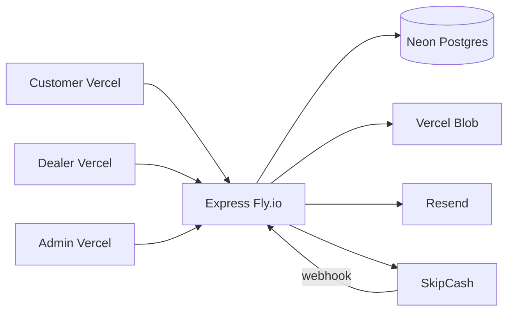

# CarFlow Production Readiness

**Status:** Careful-production launch checklist complete in code. Staging signoff required before production SkipCash keys.

---

## Production stack

| Component | Service | Notes |
|-----------|---------|-------|
| Database | **Neon** Postgres | `DATABASE_URL` connection string |
| API | **Fly.io** | Production Docker image (`node dist/index.js`); `min_machines_running = 1` |
| Frontends | **Vercel** (3 projects) | Customer, Dealer, Admin — each with `vercel.json` SPA rewrites |
| Uploads | **Vercel Blob** | Set `UPLOAD_DRIVER=blob` + `BLOB_READ_WRITE_TOKEN` |
| Email | **Resend** | Password reset, booking confirmation, email verification |
| Payments | **SkipCash** | Sandbox first, then production keys |



---

## What is production-ready

### Money integrity
- Server computes SkipCash charge from `pricePerDay × 30 × durationMonths` (client `cart.total` ignored)
- Webhook reconciles `Amount` ±0.01 before creating bookings
- Paid-but-booking-failed payments flagged `needsRefund` for admin ops
- Admin `POST /api/admin/payments/:id/refund` + Payments UI action

### Privacy / IDOR
- Dealer customer documents require rental or booking relationship
- Upload `GET /documents/file` and `DELETE /by-url` enforce ownership (admin override)

### Auth / sessions
- Refresh sessions persisted with `jti`; revoked on logout, password change, admin suspend
- `requireAuth` rejects suspended profiles mid-session
- `SameSite=None; Secure` cookies when `COOKIE_SECURE=true`
- Password min 8 + letter + number; weak JWT secrets refused at production boot

### Deploy / ops
- Multi-stage Dockerfile builds shared + backend to `dist/`
- Deploy workflow gated on full test suite (`workflow_call` to `test.yml`)
- Optional Sentry via `SENTRY_DSN`; production 500 responses sanitized

### Compliance / honesty
- Real `DELETE /api/customer/account` + PrivacySection wired
- Email verification email on signup; online pay gated on `emailVerifiedAt`
- Dealer `alert()` replaced with toasts; stub settings labeled unavailable
- Admin booking delete requires confirmation

### CI
- `.github/workflows/test.yml` — lint, typecheck, conventions, API (167 tests), E2E
- `.github/workflows/deploy.yml` — requires green tests before Fly/Vercel deploy

---

## Production environment checklist

```bash
# Database (Neon)
DATABASE_URL=postgresql://...

# JWT (rotate before launch — 32+ chars, not dev placeholders)
JWT_ACCESS_SECRET=<strong-random>
JWT_REFRESH_SECRET=<strong-random>
COOKIE_SECURE=true

# API
PORT=8080
CORS_ORIGINS=https://customer.example.com,https://dealer.example.com,https://admin.example.com
PUBLIC_API_URL=https://api.example.com
CUSTOMER_APP_URL=https://customer.example.com

# Uploads
UPLOAD_DRIVER=blob
BLOB_READ_WRITE_TOKEN=...

# Email
RESEND_API_KEY=...
FROM_EMAIL=noreply@yourdomain.com

# SkipCash (sandbox → production)
SKIPCASH_MODE=production
SKIPCASH_CLIENT_ID=...
SKIPCASH_KEY_ID=...
SKIPCASH_KEY_SECRET=...
SKIPCASH_WEBHOOK_KEY=...
# Portal paths (must be reachable on PUBLIC_API_URL): /skipcash-pay/callback, /skipcash-pay/return

# Optional observability
SENTRY_DSN=https://...

# Frontends (Vercel build env, per project)
VITE_API_URL=https://api.example.com/api
VITE_USE_MOCK_API=false
```

**Never run `db:seed` in production.**

---

## SkipCash configuration

Create-intent sends `ReturnUrl` and `WebhookUrl` on each payment (overrides portal defaults when set). Routes are mounted at both `/skipcash-pay/*` (portal paths) and `/api/payments/skipcash/*` (legacy/tests).

| Setting | Sandbox (test) | Production (www.carflow.qa) |
|---------|----------------|----------------------------|
| `SKIPCASH_MODE` | `sandbox` | `production` |
| `SKIPCASH_CLIENT_ID` | `f68772da-eb04-4458-a667-34e86e574fe0` | `d708480d-b1ca-4792-9c67-5bee32821072` |
| `SKIPCASH_KEY_ID` | `ce487912-1950-40d6-86e3-ad295e1b3e34` | `b9bbdbce-d0e3-4a37-9e35-3fc07581df51` (enabled Card Checkout) |
| `SKIPCASH_KEY_SECRET` | From portal Copy Key | From portal Copy Key — **host secrets only** |
| `SKIPCASH_WEBHOOK_KEY` | `7adcc306-8732-46b9-9da6-f8769699e8c4` | `29d76865-b757-43c4-887a-53bab3519088` |
| Portal webhook | `http://test.carflow.4livedemo.com/skipcash-pay/callback` | `https://www.carflow.qa/skipcash-pay/callback` |
| Portal return | `http://test.carflow.4livedemo.com/skipcash-pay/return` | `https://www.carflow.qa/skipcash-pay/return` |

**Local dev:** set sandbox vars in gitignored `.env`. SkipCash cannot POST webhooks to `localhost` — use the deployed test host (`test.carflow.4livedemo.com`) or an HTTPS tunnel, and set `PUBLIC_API_URL` to that public origin.

**Production deploy (Fly.io):** set production `SKIPCASH_*` via `fly secrets set` (never in local `.env`). If the API runs on a separate host from `www.carflow.qa`, either proxy `/skipcash-pay/*` to the API or set `PUBLIC_API_URL` to the API origin that mounts these routes.

```bash
# Example Fly secrets (paste full KEY_SECRET from portal)
fly secrets set \
  SKIPCASH_MODE=production \
  SKIPCASH_CLIENT_ID=d708480d-b1ca-4792-9c67-5bee32821072 \
  SKIPCASH_KEY_ID=b9bbdbce-d0e3-4a37-9e35-3fc07581df51 \
  SKIPCASH_KEY_SECRET='...' \
  SKIPCASH_WEBHOOK_KEY=29d76865-b757-43c4-887a-53bab3519088 \
  PUBLIC_API_URL=https://www.carflow.qa \
  CUSTOMER_APP_URL=https://www.carflow.qa
```

---

## Staging go / no-go (run before production keys)

| Check | Pass |
|-------|------|
| Secrets rotated; no `dev-*-change-me` JWT values | ☐ |
| `COOKIE_SECURE=true`; login works from all 3 Vercel origins against Fly API | ☐ |
| `GET /health` returns `"db":"connected"`; Fly `min_machines_running = 1` | ☐ |
| SkipCash sandbox: create-intent → webhook at `/skipcash-pay/callback` → booking → dealer approve → rental | ☐ |
| Admin refund flow for a `needsRefund` payment (or manual note path) | ☐ |
| IDOR regression: cross-dealer document access denied (API tests green) | ☐ |
| Pricing regression: client `total: 1` cannot underpay (PAY-04b green) | ☐ |
| Suspend user mid-session returns 403 on next request (RACE-07 green) | ☐ |
| Account delete removes profile; blocked with active rental | ☐ |
| Email verify link → `/verify-email` → online checkout allowed | ☐ |
| CI green on main; deploy workflow blocked on red tests | ☐ |
| Sentry receiving a test error (if `SENTRY_DSN` set) | ☐ |

**Go:** flip SkipCash to production keys and re-run one real payment in staging.  
**No-go:** any money, auth, or IDOR check fails — fix before cutover.

---

## Deploy steps

1. Create Neon database; set `DATABASE_URL` on Fly.io
2. `npm run db:push --workspace=apps/backend` against Neon (or deploy workflow migrate job)
3. `fly secrets import` from `apps/backend`
4. Tag release: `git tag v1.0.0 && git push origin v1.0.0` (triggers deploy workflow after tests pass)
5. Create three Vercel projects pointing at `apps/customer`, `apps/dealer`, `apps/admin`
6. Configure GitHub secrets: `FLY_API_TOKEN`, `VERCEL_*`, `DATABASE_URL`, `PUBLIC_API_URL`
7. Complete staging go/no-go checklist above
8. Switch SkipCash from sandbox to production keys

---

## Intentional post-launch (enterprise backlog)

Tracked in `tests/gap-registry.json`: Stripe, 2FA, SMS verify, rental extensions, reviews, i18n/RTL, dealer AI analytics, fleet ops.

---

## Verdict

CarFlow is **ready for careful production launch** after staging signoff on Neon + Fly.io + Vercel with SkipCash sandbox fully green, then production payment keys.
